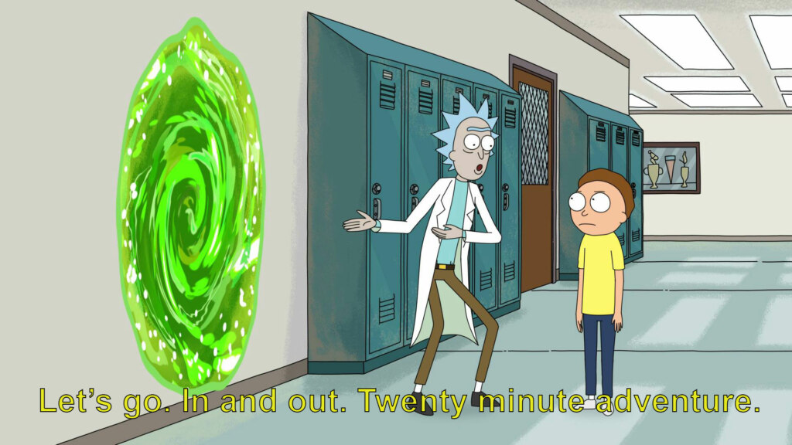
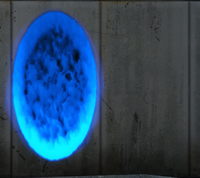

---
# You can also start simply with 'default'
theme: default
# random image from a curated Unsplash collection by Anthony
# like them? see https://unsplash.com/collections/94734566/slidev
background: https://images.unsplash.com/photo-1588153191435-c890d9adbb99?q=80&w=2070&auto=format&fit=crop&ixlib=rb-4.1.0&ixid=M3wxMjA3fDB8MHxwaG90by1wYWdlfHx8fGVufDB8fHx8fA%3D%3D
# some information about your slides (markdown enabled)
title: История развития Vue
info: |
  ## Slidev Starter Template
  Presentation slides for developers.

  Learn more at [Sli.dev](https://sli.dev)
# apply unocss classes to the current slide
class: text-center
# https://sli.dev/features/drawing
drawings:
  persist: false
# slide transition: https://sli.dev/guide/animations.html#slide-transitions
transition: slide-left
# enable MDC Syntax: https://sli.dev/features/mdc
mdc: true
# open graph
# seoMeta:
#  ogImage: https://cover.sli.dev
---

# Сначала было слово

<div v-click class="slidev-vclick-target slidev-vclick-hidden">И слово было «я устал писать на ангуляре»</div>

---

## В 2014 году сотрудник Google подумал...

<br/>
<div v-click class="slidev-vclick-target slidev-vclick-hidden">Многие задачи можно упростить, если не писать на англуре</div>
<br/>
<div v-click class="slidev-vclick-target slidev-vclick-hidden">Тогда он решил создать инструмент: который был бы проще и легче, чем существующие фреймворки, но при этом оставался мощным.</div>

---

## Как вы уже наверное догадались, речь пойдет о Vue


<style>
  .logo {
    margin: 120px auto 0;
    width: 200px;
    height: 200px;
  }
</style>

---

# 2013-2014: Рождение Vue.js

<br/>
Эван Ю, работая в Google над проектами, связанными с AngularJS, решил создать более легкий и гибкий фреймворк.

В феврале 2014 года он опубликовал первую версию на github как open-source проект.

---

# 2015: Vue 1.0

<br/>

В июле 2015 года вышла версия 1.0.

Vue начинает быстро набирать популярность длагодаря простоте, легкой интеграции и понятной документации.

Также сообщество начинает создавать первые плагины для Vue.

---

# 2016-2017: Vue 2.0

<br/>

В сентябре 2016 года выходит Vue 2.0.

Среди основных нововведений были: vDOM, улучшенная производительность, поддержка SSR и компоненты на основе ES2015+.

Также появились официальные инструменты: Vue Router, Vuex и Vue CLI.

---

# 2018-2019: Экосистема и признание

<br/>

Vue.js становится одним из самых популярных JS-фреймворков наряду с React и Angular.

Появляется Nuxt.js, Vuetify и другие проекты

Vue начинает активно использоваться по всему миру 🎉

---

# 2020: Анонс Vue 3.0

<br />

В сентябре 2020 года выходит Vue 3.0.

основные изменения: полностью переписали на TypeScript, Composition API, улучшенная производительность, поддержка фрагментов, Teleport и Suspense.

Vue 3 становится новым стандартом, но Vue 2 продолжает поддерживаться.

---

# 2021-2023: Развитие Vue 3

<br />

Постепенный переход экосистемы на Vue 3 (Vuex, Vue Router, Vuetify и др.).

Появление Pinia (новый state-менеджер), улучшения в DevTools, поддержка новых возможностей JavaScript.

Vue 3 становится стабильным и рекомендуемым для новых проектов.

---

# 2024-2025: Современное состояние

<br/>

Vue.js — зрелый, активно развиваемый фреймворк с широкой экосистемой.

Используется как для малых, так и для крупных корпоративных приложений.

Сообщество активно участвует в развитии, появляются новые плагины, инструменты и подходы.

---

## Сравнение Vue 2 и Vue 3. Обновиление работы реактивности

<small>считаем количество слов «реактивность»</small>

````md magic-move {lines: true}
```ts
// Vue 2.0
```

```ts {all|1-2|3|4|5}
// Vue 2.0
const obj = { a: 1 };
Vue.observable(obj);
obj.a = 2; // реактивно
obj.b = 3; // не реактивно, если не использовать Vue.set(obj, 'b', 3)
```

```ts
// Vue 2.0
const obj = { a: 1 };
Vue.observable(obj);
obj.a = 2; // реактивно
Vue.set(obj, "b", 3); // реактивно
```

```ts
// Vue 3.0
```

```ts {all|2|3|4|}
// Vue 3.0
import { reactive } from "vue";
const obj = reactive({ a: 1 });
obj.a = 2; // реактивно
```

```ts
// Vue 3.0
import { reactive } from "vue";
const obj = reactive({ a: 1 });
obj.a = 2; // реактивно
obj.b = 3; // тоже реактивно!!!
```

```ts
// Vue 3.0
import { reactive } from "vue";
const obj = reactive({ a: 1 });
obj.a = 2; // реактивно
obj.b = 3; // тоже реактивно!!!
delete obj.a; // тоже реактивно!!!!!!
```
````

<!--
В Vue 2 реактивность основана на перехвате доступа к свойствам объекта с помощью Object.defineProperty.
Для каждого свойства объекта создаётся геттер и сеттер, которые отслеживают чтение и запись.
Когда свойство читается, Vue "подписывает" компонент на обновления этого свойства.
Когда свойство изменяется, Vue уведомляет все подписанные компоненты о необходимости обновления.
Ограничения:
Нельзя отследить добавление новых свойств или удаление существующих (например, Vue.set и Vue.delete нужны для этого).
Массивы отслеживаются только через перезапись методов (push, pop и т.д.), но не через прямое изменение индексов.
Глубокая вложенность объектов требует рекурсивного обхода и "реактивизации" всех вложенных свойств.

В Vue 3 реактивность реализована с помощью ES6 Proxy.
Proxy позволяет перехватывать любые операции с объектом: чтение, запись, удаление, добавление новых свойств, работу с массивами и т.д.
Реактивность теперь "глубокая" по умолчанию и не требует специальных методов для добавления/удаления свойств.
Реализованы новые API: reactive, ref, computed, watch и др.
Преимущества:
Нет необходимости в Vue.set и Vue.delete.
Легко отслеживать любые изменения, включая добавление/удаление свойств и работу с массивами.
Лучшая производительность и меньший объём кода ядра.
-->

---

## Сравнение Vue 2 и Vue 3. Composition API

````md magic-move {lines: true}
```vue {*|3-4,19|5-13|14-18}
<script>
// Vue 2.0
export default {
  name: "ExampleComponent",
  data() {
    return {
      counter: 2,
      author: {
        name: "Anthony Fu",
        projects: ["Slidev", "Nuxt devtools", "@vue/reactivity"],
      },
    };
  },
  methods: {
    increment() {
      this.counter++;
    },
  },
};
</script>
```

```vue {*|3|4-5,23|6,22|7-11|13-15|17-21}
<script>
// Vue 3.0
import { ref, reactive } from "vue";
export default {
  name: "ExampleComponent",
  setup() {
    const counter = ref(2);
    const author = reactive({
      name: "Anthony Fu",
      projects: ["Slidev", "Nuxt devtools", "@vue/reactivity"],
    });

    function increment() {
      counter.value++;
    }

    return {
      counter,
      author,
      increment,
    };
  },
};
</script>
```

```vue
<script setup>
// Vue 3.2+
const counter = ref(2);
const author = reactive({
  name: "Anthony Fu",
  projects: ["Slidev", "Nuxt devtools", "@vue/reactivity"],
});

function increment() {
  counter.value++;
}
</script>
```
````

---

## Сравнение Vue 2 и Vue 3. Teleport

<br />

<div v-click>
Какой ещё <span v-mark.circle.orange="4">телепорт</span>?

</div>

  <div class="images">
    
    
  </div>

<style>
  .portal {
    margin: 20px 0 0;
    width: 100%;
    height: 300px;
    object-fit: contain;
  }

  .portal-2 {
    margin: 20px auto 0;
    width: 100%;
    height: 200px;
    object-fit: contain;
  }

  .images {
    display: grid;
    grid-template-columns: 1fr 1fr;
  }
</style>

---

## Сравнение Vue 2 и Vue 3. Teleport

````md magic-move {lines: true}
```vue {all|4-5|6-13}
<template>
  <div>
    Vue 2
    <button @click="show1 = true">Открыть модалку 1</button>
    <button @click="show2 = true">Открыть модалку 2</button>
    <div v-if="show1" class="modal">
      <p>Это модальное окно!</p>
      <button @click="show1 = false">Закрыть модалку 1</button>
    </div>
    <div v-if="show2" class="modal">
      <p>Это модальное окно!</p>
      <button @click="show2 = false">Закрыть модалку 2</button>
    </div>
  </div>
</template>
```

```vue {all|6,15|all}
<template>
  <div>
    Vue 3
    <button @click="show1 = true">Открыть модалку 1</button>
    <button @click="show2 = true">Открыть модалку 2</button>
    <teleport to="body">
      <div v-if="show1" class="modal">
        <p>Это модальное окно!</p>
        <button @click="show1 = false">Закрыть модалку 1</button>
      </div>
      <div v-if="show2" class="modal">
        <p>Это модальное окно!</p>
        <button @click="show2 = false">Закрыть модалку 2</button>
      </div>
    </teleport>
  </div>
</template>
```

```vue
<template>
  <div>
    Vue 3
    <button @click="show1 = true">Открыть модалку 1</button>
    <button @click="show2 = true">Открыть модалку 2</button>
    <teleport to="#teleport-target">
      <div v-if="show1" class="modal">
        <p>Это модальное окно!</p>
        <button @click="show1 = false">Закрыть модалку 1</button>
      </div>
      <div v-if="show2" class="modal">
        <p>Это модальное окно!</p>
        <button @click="show2 = false">Закрыть модалку 2</button>
      </div>
    </teleport>
  </div>
</template>
```
````

<!--
Teleport — это встроенный компонент, появившийся в Vue 3, который позволяет "телепортировать" (перемещать) часть разметки из текущего компонента в другое место DOM-дерева, вне обычной иерархии компонентов.
Зачем нужен Teleport?
Иногда нужно, чтобы определённый элемент отображался вне текущего компонента или даже вне корневого элемента приложения. Типичные примеры:
Модальные окна (modals)
Всплывающие подсказки (tooltips)
Дропдауны, popovers и т.д.
Если такие элементы рендерить внутри обычной иерархии, могут возникнуть проблемы с CSS (например, z-index, overflow: hidden, позиционирование). Teleport решает эту проблему.
Как работает Teleport?
Вы указываете, что содержимое <teleport> должно быть вставлено в определённый элемент DOM (например, в <body>).
Vue сам перемещает содержимое в нужное место, но при этом сохраняет реактивность и логику компонента.
-->

---

# Спасибо за внимание

<br/>

С вами был Вадим Губченко

<small>Кстати, эта презентация сделана на Vue 🫡</small>
